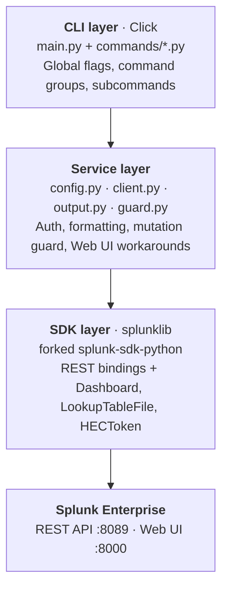
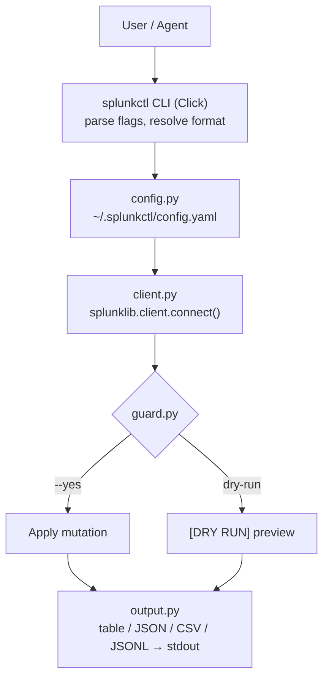

# Architecture

How splunkctl is built — the layers, the data flow, and the design decisions.

## Layers

## Data flow

## Auth resolution

Priority (highest first):

1. CLI flags (`--host`, `--port`, `--token`)
2. Environment variables (`SPLUNK_HOST`, `SPLUNK_PORT`, `SPLUNK_TOKEN`,
   `SPLUNK_USER`, `SPLUNK_PASS`)
3. Config file (`--config <path>` or `~/.splunkctl/config.yaml`)

Auth is **lazy** — credentials resolve on first API call. Help, version,
config, and offline commands never trigger auth.

## Remote-first design

The CLI runs on the engineer's laptop and operates a remote Splunk
instance. It never assumes filesystem access to the Splunk server. All
operations go through:

- **REST API** (port 8089) — the primary interface for all operations
- **Web UI** (port 8000) — used only where the REST API has gaps

## Web UI workarounds

The Splunk REST API cannot handle certain file uploads. For these, the
CLI uses the Web UI form handlers (the same endpoints the browser uses):

| Operation | Why REST fails | Web UI endpoint |
|---|---|---|
| Lookup upload | `eai:data` requires server-side path | `POST /manager/{app}/data/lookup-table-files/_new` |
| App install | REST expects server-side file path | `POST /manager/appinstall/_upload` |

The `_WebSession` class in `client.py` handles login, CSRF tokens, and
multipart form-data encoding for these uploads.

Data upload (`search upload`) uses `POST /services/receivers/simple`
which works over REST — no Web UI needed.

## SDK fork

The [forked SDK](https://github.com/dannyota/splunk-sdk-python/tree/splunkctl)
adds entity classes missing from upstream:

| Entity | Collection | Service property |
|---|---|---|
| `Dashboard` | `Dashboards` | `service.dashboards` |
| `LookupTableFile` | `LookupTableFiles` | `service.lookup_table_files` |
| `HECToken` | `HECTokens` | `service.hec_tokens` |

Each follows the SDK's existing `Entity`/`Collection` patterns. For
surfaces not worth a full SDK class, the generic `confs` API
(`client.confs["props"]`) works as an escape hatch.

## Design principles

1. **Dry-run by default.** Every mutation previews before applying.
2. **Dual output.** TTY gets tables, pipes get JSON. Always overridable.
3. **Lazy everything.** Auth, SDK connection, config loading — all deferred
   until needed.
4. **One file per command group.** Each `commands/*.py` is self-contained.
5. **SDK-first.** Use the SDK for everything it supports; Web UI workaround
   only for documented gaps.
6. **Remote-first.** Never use local filesystem for server operations.
7. **Agent-friendly.** Machine-readable output, self-discovery, embedded skill.
